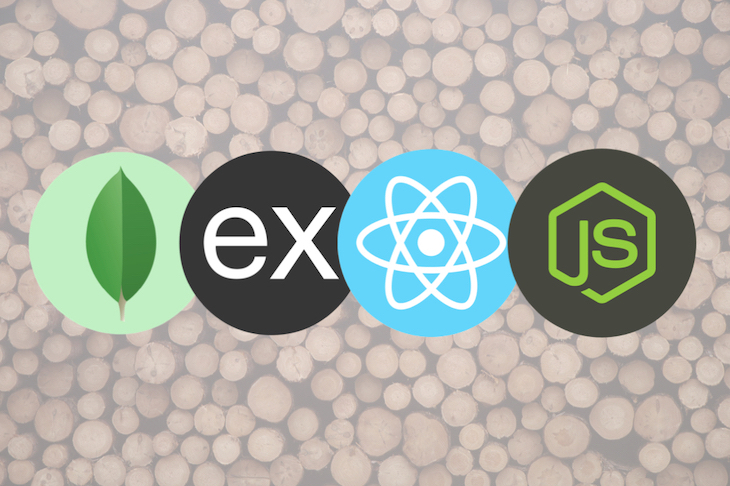

# Mern Skeleton
A Boilerplate to Build Applications using MongoDB, Express, React, and Node



### What you need to run this code
1. Node (13.12.0)
2. NPM (6.14.4)
3. MongoDB (4.2.0)
4. Yarn (1.21.1)


###  How to run this code
1. Clone this repository
2. Create a `.env` in the `server` directory.
3. In the add the following `MONGODB_URI=mongodb://localhost:27017/mernskeleton`
4. You can also use MongoDB Atlas also as your cloud database. 
6. Open command line in the cloned folder, 
   - To install dependencies, run ```  yarn  ```
   - To run the application for development, run ```  yarn development  ```
7. Open [localhost:9018](http://localhost:9018/) in the browser
